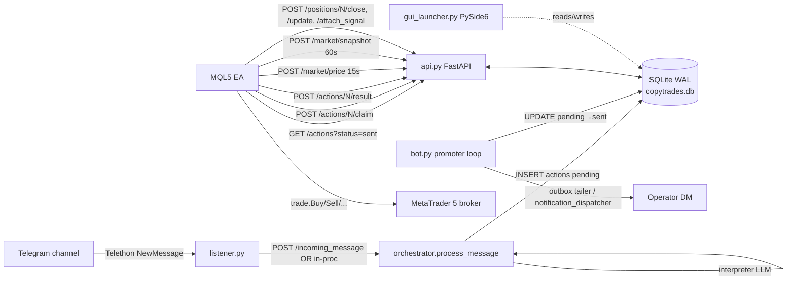

# 00 — Overview

**Summary.** CopyTrades is a single-operator Telegram→MT5 signal bridge for **XAUUSD (gold) only**, written for one user (the owner) trading off an Arabic-language signal channel ("Forex Engineer"). Four long-running processes — a Telethon **listener**, a python-telegram-bot control **bot**, a FastAPI **api**, and an MQL5 **Expert Advisor** running inside MetaTrader 5 — share **one SQLite database per "stack"** as the sole coordination medium. There is no message queue, no IPC, no RPC; every state transition is a row update.

## What the system does today

- Listens to **one specific Telegram channel** via a Telethon user-account session (`src/listener.py:401`).
- Runs each incoming message through a cascade: deterministic prefilter → operator-curated trigger matcher → LLM triage (Haiku / gpt-5-nano) → LLM interpreter (Claude Sonnet 4.6 / gpt-5), each stage able to short-circuit (`src/orchestrator.py:186`).
- The interpreter emits a list of typed actions (one of 16 types — see `docs/03-SIGNAL-PARSING.md`) validated by Pydantic models in `src/validators.py`.
- Actions are persisted to the `actions` table and progress through a strict lifecycle `pending → sent → claimed → {executed | failed | rejected | watching}` (CHECK constraint, `src/schema.sql:63`).
- The MQL5 EA (`ea/CopyTrades.mq5`, ~4100 LOC) polls `GET /actions?status=sent` every second, claims each action via `POST /actions/{id}/claim`, executes the broker side, then reports back via `POST /actions/{id}/result`.
- The bot DMs the operator on every terminal action and offers Cancel/Execute inline buttons. The owner can `/halt` (kill switch), `/cancel <id>`, `/execute <id>`, `/closeall`.

## Business problem solved (as evidenced by code)

- **Single operator** is the only target user: `_owner_only(user_id)` in `src/bot.py:23` checks against one hardcoded `TG_BOT_OWNER_USER_ID`; every command and callback hard-rejects any other Telegram user.
- **One channel → one MT5 terminal → one trading account.** Hard invariants enforced in code and prompt: one symbol (XAUUSD), at most one open position at a time (`_has_open_position` in `src/validators.py:391`, `CountOurOpenPositions()` in EA), no human approval gate (auto-promote after `default_auto_execute_delay_sec`, default 0 — `src/db_settings.py:55`).
- A partial **multi-channel/multi-destination v2 routing layer** has been scaffolded (`src/config_v2.py`, ~1000 LOC; `docs/plans/2026-05-23-multi-channel-routing.md` referenced repeatedly in source comments). Step 12 ("multi-channel destinations") is **deferred** — current production assumes 1 channel : 1 destination per stack. See `docs/07-PRODUCT-READINESS-GAPS.md`.

## High-level architecture

There is also a **PySide6 GUI launcher** (`src/gui/`, ~50 view/panel/service modules) — operator dashboard, setup wizard, services-bar (NSSM control), profile editor, replay tab, evaluation view. It is a fat client that talks directly to the same SQLite DB and (for some operations) shells `nssm` and the FastAPI endpoints.

## Process topology

| Process | Entrypoint | Purpose | Long-running? |
|---|---|---|---|
| api | `python -m src.api` | FastAPI on 127.0.0.1:8765 (`src/api.py:1280`); EA poll + listener ingest endpoints | yes |
| bot | `python -m src.bot` | Telegram bot polling + promoter + claim sweeper + ~10 feed/cost/notification loops (`src/bot.py:329`) | yes |
| listener | `python -m src.listener` | Telethon, watches one chat, dispatches to the API (or in-proc orchestrator) | yes |
| EA | `ea/CopyTrades.mq5` | Compiled to `.ex5`, attached to a chart in MT5; polls API on `OnTimer` every 1s | yes |
| GUI | `python gui_launcher.py` / `CopyTrades.exe` (PyInstaller) | Operator dashboard; optional, not required for trading | when operator is at the console |

On Windows the three Python services are typically installed as **NSSM services** (`services/install_services.bat`) named e.g. `CT-SMC-Api`, `CT-SMC-Bot`, `CT-SMC-Listener` per "stack" — the operator runs multiple stacks side-by-side (the install script shows an "SMC stack" + an "Arabic stack" on the same machine).

## Domain glossary

- **Stack** — one full Python services + DB + Telegram session triple for ONE channel. `<APPDATA>/CopyTrades/<stack-name>/copytrades.db`. Used to run multiple channels in parallel on one machine via NSSM (`src/config.py:35`).
- **Signal** — a complete trade instruction: side (BUY/SELL), entry price or zone, stop-loss (SL), one to three take-profit levels (TPs).
- **Lot** — MT5 position size unit. 1 lot of XAUUSD = 100 oz. Default `LotsPer100Balance=0.01` (EA input).
- **SL / TP** — stop loss / take profit price levels.
- **Magic number** — integer tag MT5 stores on each order so the EA can tell its own positions apart from manual ones / other EAs (default `919191`, configurable per stack).
- **Slippage** — broker-side fill price deviation; capped at `SlippagePoints=50` (EA input).
- **Action** — one row in `actions` table, one of 16 types. Lifecycle: `pending → sent → claimed → {executed | failed | rejected | watching}`.
- **Position** — one row in `positions` table; created on `POST /actions/N/result` with `status='executed'` and a leg snapshot.
- **Claim** — atomic transition `sent → claimed` via `POST /actions/N/claim` so only one EA tick acts on each action.
- **Watching** — an OPEN that's been placed as a broker pending limit (BuyLimit / SellLimit) and is waiting to fill.
- **Singleton** — the at-most-one open position. Management actions (MOVE_SL_BE, CLOSE_PARTIAL, etc.) have no `mt5_ticket`; the EA finds the singleton via `FindSingletonOpenTicket()` (`ea/CopyTrades.mq5:2682`).
- **Naked position** — opened by `OPEN_INSTANT` (a bare "buy gold" command) with only an emergency SL and no signal-defined TPs; expects a later `ATTACH_SIGNAL` to wire SL/TPs or trail on a timeout.
- **Chase-price** — EA fills at market when price has moved past the entry zone, gated by `ChaseMinRewardRatio` (`ea/CopyTrades.mq5:81`).
- **Fingerprint** — bucketed `symbol|side|entry_mid|sl|tps[]` hash used to dedupe re-quoted OPEN signals within a time window (`src/fingerprint.py`).
- **TradePlan (EA-side)** — in-memory struct tracking staged partial closes / SL moves for a multi-TP signal (`ea/CopyTrades.mq5:222`).
- **Triage** — cheap binary `keep|ignore` LLM call (Haiku / gpt-5-nano) that gates the expensive interpreter.
- **Interpreter** — main LLM call (Sonnet 4.6 / gpt-5) producing structured JSON actions; the ~11 KB system prompt is the central piece of IP.
- **Channel profile** — JSON file (`channels/<name>.json` or per-stack `<APPDATA>/CopyTrades/<stack>/profile.json`) containing the channel's vocabulary table, worked examples, promo indicators, commentary filter, symbol aliases. Loaded by `src.profile_context`.
- **Trigger matcher** — deterministic + embedding-similarity matcher that fires operator-curated action shortcuts BEFORE the LLM stages (`src/trigger_matcher.py`).
- **Evaluator** — async LLM "directional bias" scorer that runs after each OPEN insert, writes a `0-100` score back into `actions.payload_json["evaluation"]`. Informational only — never gates execution (`src/ai_evaluator.py`, `src/evaluator/`).
- **Signal memory** — running per-channel summary buffer that replaces the raw 20-message chat window in the prompt (`src/signal_memory.py`).
- **v2 config** — JSON file `<APPDATA>/CopyTrades/stacks_config.json` describing 7 entities (Account, Profile, Channel, Destination, Bot, Route, BotBinding). Foundation for multi-channel; partially wired (`src/config_v2.py`).
- **Bot outbox** — `bot_outbox` table; per-bot notification queue introduced for v2 multi-bot fan-out (`src/notification_dispatcher.py`).
- **DPAPI** — Windows Data Protection API; used to encrypt secrets at rest in the `settings` table with `CRYPTPROTECT_LOCAL_MACHINE` so services running under LocalSystem can decrypt (`src/secret_box.py`).
- **Cost guard** — per-day USD budget watchdog that flips the kill switch when `cost_daily_budget_usd * cost_cap_multiplier` is breached (`src/cost_guard.py`).
