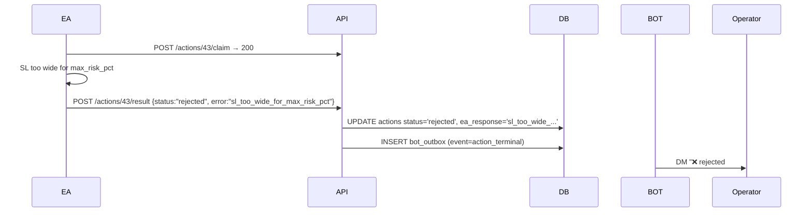

# 01 — Architecture

**Summary.** Four long-running processes share **one SQLite DB per stack** as the only coordination medium — no MQ, no IPC, no RPC. Every state transition is a row update; lifecycle correctness is enforced by `CHECK` constraints and atomic `UPDATE ... WHERE status=?` writes. The architecture is intentionally minimal and single-tenant: one channel, one MT5 terminal, one operator.

## Components and responsibilities

### 1. `src/listener.py` (Telethon, user-account session)

- Opens a Telethon `TelegramClient` from a DPAPI-encrypted `tg_session_blob` stored in `settings` (`src/listener.py:489`).
- Subscribes to ONE chat: `config.TG_WATCHED_CHAT_ID` captured at handler-attach time (`src/listener.py:532`). **Per `REVIEW.md`, this is not live-reloadable — Settings UI implies it is.**
- On `NewMessage`: either POSTs to `http://127.0.0.1:8765/incoming_message` (v2 path; `src/listener.py:553`) OR calls `orchestrator.process_message` in-process (legacy single-stack path; `src/listener.py:586`).
- Backfill: on startup and after every reconnect, calls `client.iter_messages(chat, min_id=last_seen)` and feeds anything within `BACKFILL_MAX_AGE_MIN` (default 30) through the AI pipeline, flagged `is_backfill=True` (`src/listener.py:215`). First-ever launch archives history without processing.
- A "second-pass catchup" runs 6 s after first connect to recover messages dropped by Telethon's first-burst MTProto envelope checks (`src/listener.py:333`).
- Resilience: `connection_retries=-1`, `auto_reconnect=True`, supervisor loop with exponential backoff (`src/listener.py:686`).
- Heartbeat: writes `listener_telegram_ok_at` every 30 s (`src/listener.py:310`).

### 2. `src/orchestrator.py` (in-proc, called either from listener or from API's background task)

- `process_message` (`src/orchestrator.py:186`) is the pipeline conductor:
  1. INSERT into `messages` (UNIQUE on `chat_id, tg_message_id`).
  2. **Stage 0 prefilter**: `prefilter.should_drop_by_symbol` + `prefilter.looks_like_ad` (deterministic, config-driven by profile JSON; `src/prefilter.py`).
  3. **Stage 1 trigger matcher** (`src/trigger_matcher.py`): operator-curated phrases → deterministic substring + embedding-similarity match → emits Action objects. Bypasses both triage and the interpreter.
  4. **Stage 2 triage**: cheap binary `keep|ignore` LLM call (Haiku / gpt-5-nano), `src/ai_triage.py`.
  5. **Stage 3 interpreter**: full Sonnet 4.6 / gpt-5 call with the 11 KB system prompt + SYSTEM STATE block (`src/ai.py`, `src/state_summary.py`).
  6. Persistence: validate each action via `validate_action`, fingerprint OPENs, write rows. Compound emits like `[CLOSE_FULL, OPEN]` are inserted in order; OPEN's "position already open" guard checks `preceding_actions` (`src/validators.py:409`).
  7. Fire-and-forget `kick_evaluator_for_open` thread for each OPEN/OPEN_INSTANT (`src/orchestrator.py:857`).
- Each stage's terminal decision is written back onto the `messages` row (`decided_stage`, `decided_outcome`, `pipeline_meta_json`) so the GUI Pipeline view doesn't have to scan the JSONL log.

### 3. `src/api.py` (FastAPI, port 8765)

- Built in `build_app(conn, ...)` (`src/api.py:113`). Two middlewares: shared-secret auth (`X-EA-Token` for EA endpoints, `X-Listener-Token` for `/incoming_message` — falls back to EA token), and 4xx/5xx-only HTTP error logging (200s are not logged because the EA polls every second).
- Endpoints fall into five groups (see `docs/04-MT5-INTEGRATION.md` for full list).
- **No business logic.** The API only translates HTTP↔SQL. The EA decides whether to open / chase / watch / skip; the API records the result.
- Maintains `partial_close_count` and `sl_moved_at` as derived bookkeeping driven by what the EA POSTs (`src/api.py:578`).

### 4. `src/bot.py` (python-telegram-bot, polling)

- `_owner_only` check on every command and callback — single-operator design (`src/bot.py:23`).
- Commands: `/start`, `/status`, `/halt`, `/resume`, `/cancel <id>`, `/execute <id>`, `/positions`, `/closeall` (`src/bot.py:27–118`).
- `post_init` (`src/bot.py:329`) spawns ~12 supervised asyncio loops:
  - `promotion_loop` — every 1 s, flips `pending → sent` when `execute_after` has elapsed (`src/promoter.py:9`).
  - `claim_sweeper_loop` — every 15 s, recycles claims older than 300 s back to `sent`.
  - `notification_dispatcher` OR `bot_outbox_tailer.OutboxTailer` — DMs operator on terminal actions; v2 binding picks the tailer path, otherwise the legacy poller (`src/bot.py:374`).
  - `position_close_notifier` — legacy path only.
  - Five feed loops: `macro`, `cot`, `etf_flows`, `news_scan`, `calendar` (gold-context inputs for the evaluator; `src/feeds/`).
  - `telegram_heartbeat_loop` — bot-side health beacon.
  - `cost_guard_loop` — daily budget enforcement (`src/cost_guard.py`).
- A done-callback (`_supervise`) hard-exits the process if any supervised loop dies, so launch.bat / NSSM restarts the whole bot rather than running with a silently-dead loop (`src/bot.py:302`).

### 5. `ea/CopyTrades.mq5` (MQL5 Expert Advisor, runs inside MT5)

- ~4100 LOC, plus `ea/Dashboard.mqh` (696 LOC, canvas dashboard) and `ea/BrokerCheck.mqh` (227 LOC, startup capability checks).
- `OnTimer(PollIntervalSec=1)` polls `GET /actions?status=sent`.
- `ExecuteOne` (`ea/CopyTrades.mq5:1165`) is the dispatcher: claim → branch on `action_type` (13 cases — OPEN, MODIFY, CLOSE, CLOSE_ALL, MOVE_SL_BE, MOVE_SL, CLOSE_PARTIAL, CLOSE_FULL, REOPEN_LAST, REINFORCE, TIGHTEN_SL, MODIFY_TPS, OPEN_INSTANT, ATTACH_SIGNAL — ALERT and CANCEL_PENDING never reach the EA).
- `ManagePlans()` runs every tick to enforce the staged-partial-close + trailing-SL policy described in `CLAUDE.md`.
- `ReconcileClosedPositions()` runs every tick: scans 48h history + queries `GET /positions?status=open` and closes any DB-open ticket MT5 doesn't recognize (`ea/CopyTrades.mq5:3083`).
- `HeartbeatMarketPrice()` every 15 s, `PostMarketSnapshot()` every minute, `FetchLatestEvaluation()` every 5 s.
- Persists `g_plans[]`, `g_pending_orders[]`, naked positions to MT5 `GlobalVariables` so an EA restart doesn't lose in-flight state.

### 6. `gui_launcher.py` / `src/gui/` (PySide6 Qt fat client)

- ~50 modules across `views/`, `panels/`, `services/`, `windows/`, `helpers/`, `models/`.
- Operator-only utility; not required for trading. Talks directly to the SQLite DB and (for service control) shells `nssm.exe`.
- Notable views: `live_view`, `journal_view`, `pipeline_view`, `evaluation_view`, `triggers_view`, `unmatched_view`, `replay_view`, `profile_view`, `prompts_view`, `cost_view`, `risk_view`, `audit_view`, `bot_bindings_view`, `routes_matrix_view`, `v2_config_view`, `settings_view`.
- Setup wizard at first run (`src/gui/windows/main_window.py`, `src/gui/windows/telegram_wizard.py`, `src/gui/services/profile_wizard.py`).

## Communication contracts

### EA ↔ API

All requests carry `X-EA-Token: <ea_shared_token>` (when set in DB settings). EA → API:

| Method | Path | Body | Purpose |
|---|---|---|---|
| GET | `/actions?status=sent&limit=50` | — | Poll work queue |
| POST | `/actions/{id}/claim` | `{}` | Atomic `sent → claimed` |
| POST | `/actions/{id}/result` | `{status, mt5_ticket?, snapshot?, legs?, error?}` | Report terminal |
| GET | `/actions/{id}` | — | Detect server-side cancellation of a watching pending |
| GET | `/actions/latest_open_evaluation` | — | Dashboard SIGNAL QUALITY widget |
| GET | `/positions?status=open` | — | Reconciliation oracle |
| POST | `/positions/{ticket}/update` | `{volume?, sl?, tp?, realized_pnl_delta?}` | Partial close / SL move |
| POST | `/positions/{ticket}/attach_signal` | `{sl, tp}` | OPEN_INSTANT → ATTACH_SIGNAL wiring |
| POST | `/positions/{ticket}/close` | `{reason, exit_price?, realized_pnl?}` | Final close |
| GET | `/positions/last_closed?symbol=&within_hours=` | — | REOPEN_LAST / REINFORCE source-params |
| GET | `/positions/by_ticket/{ticket}` | — | REINFORCE pre-close snapshot |
| POST | `/market/price` | `{symbol, bid, ask}` | 15 s heartbeat (unconditional, even when halted) |
| POST | `/market/snapshot` | `{symbol, m15, h1, h4, d1?, d1_prev?, adr20?, adx_h1?, ...}` | 60 s OHLC+ATR for evaluator |
| POST | `/market/snapshot/state` | `{symbol, enabled}` | Snapshot on/off sentinel for GUI services-bar |
| POST | `/alerts` | `{level, text}` | EA-side escape hatch for ManagePlans giveups, broker check warnings |
| GET | `/events/recent?limit=20` | — | LogPanel dashboard widget |

### Listener → API (v2 only)

- `POST /incoming_message` with `X-Listener-Token` header. Body fields: `channel_id`, `tg_chat_id`, `tg_message_id`, `text`, `sender`, `received_at`, `is_backfill`, `route_id`, `sizing_multiplier`, `failover_from_destination_id`, `reply_to_tg_message_id` (`src/listener.py:131`). API queues `orchestrator.process_message` as a BackgroundTask, returns `202`.

### Action payload shapes

See `src/validators.py` — 16 Pydantic models. Inserted as `json.dumps(action.model_dump(exclude={'type'}))` into `actions.payload_json`.

## Mermaid sequence: successful BUY trade

```mermaid
sequenceDiagram
    participant TG as Telegram channel
    participant L as listener.py
    participant API as api.py (FastAPI)
    participant DB as SQLite
    participant BOT as bot.py
    participant OP as Operator
    participant EA as MT5 EA
    participant MT5 as Broker

    TG->>L: "GOLD BUY 4694-4692 SL 4686 TP 4705"
    L->>API: POST /incoming_message
    API->>API: BackgroundTask: orchestrator.process_message
    Note over API: prefilter→matcher→triage→interpreter
    API->>DB: INSERT actions(type=OPEN, status=pending, execute_after=now+0s)
    Note over API: kick_evaluator thread (async)
    BOT->>DB: promote_due_actions: pending→sent
    BOT->>OP: DM "OPEN BUY 4694-4692 SL 4686 [Cancel]"
    EA->>API: GET /actions?status=sent
    API-->>EA: [{id:42, type:"OPEN", payload:{...}}]
    EA->>API: POST /actions/42/claim
    API->>DB: UPDATE actions status='claimed' WHERE status='sent'
    API-->>EA: 200 OK
    EA->>MT5: trade.Buy(lots, sl, tp_final)
    MT5-->>EA: ticket=8802700000
    EA->>API: POST /actions/42/result {status:"executed", mt5_ticket, snapshot}
    API->>DB: UPDATE actions status='executed'; INSERT positions
    API->>DB: INSERT bot_outbox (event=action_terminal)
    BOT->>OP: DM "✅ executed #42 ticket 8802700000"
    EA-->>EA: RegisterPlan(ticket, ...) for staged management
```

## Mermaid sequence: failed trade (broker rejects)



## Data persistence

**Storage:** single per-stack SQLite file at `<APPDATA>/CopyTrades/<stack>/copytrades.db` (Windows) or `$DB_PATH` env override. WAL mode, `wal_autocheckpoint=1000` pages (`src/db.py:7`).

**Tables** (see `src/schema.sql` + 17 idempotent migrations in `src/db.py:init_schema`):

| Table | Rows per | Purpose |
|---|---|---|
| `messages` | 1 per Telegram message | text, sender, `is_backfill`, `source_channel_id`, `reply_to_tg_message_id`, pipeline decision columns |
| `actions` | 1+ per message | the 16 action types + lifecycle status + payload_json + fingerprint + source_channel/route |
| `positions` | 1 per executed OPEN | mt5_ticket, side, volume, original_volume, partial_close_count, sl_moved_at, is_naked, exit_price, realized_pnl |
| `signal_memory` | 1 per categorized message | running per-chat summary buffer (replaces raw chat window) |
| `settings` | key→value | all config (host/port, API keys encrypted, models, thresholds, market_XAUUSD_bid/ask/at, market_snapshot_*) |
| `bot_outbox` | 1 per event per bot binding | v2 notification queue (`bot_id, event_type, event_payload, delivered_at`) |
| `unmatched_messages` | 1 per "trigger candidate" | curation backlog: Sonnet emitted a deterministic-shaped action that the matcher missed (`src/unmatched_store.py`) |

**Key invariants** (enforced in code/SQL):

- `actions.action_type` CHECK ∈ 16 values; `actions.status` CHECK ∈ 8 values (`src/schema.sql:53`).
- `positions.original_volume` is set on insert and **never updated** (except healing case at `src/api.py:617`). `partial_close_count` increments only when `body.volume < row['volume']`. `sl_moved_at` is set once on first SL change.
- `messages.UNIQUE(chat_id, tg_message_id)` prevents redelivery double-processing.
- `positions.mt5_ticket UNIQUE` — `INSERT OR IGNORE` (not REPLACE) so re-POSTing a result for an already-closed ticket cannot resurrect it.
- Action result POST is guarded by `WHERE status IN ('claimed','watching')` so a re-claimed action's stale POST can't overwrite (`src/api.py:452`). This was a P0 fix per `REVIEW.md`.

**What survives a restart:**

- All DB rows (obviously).
- EA in-flight state (`g_plans[]`, `g_pending_orders[]`, naked positions) — persisted to MT5 GlobalVariables.
- Telegram session: DPAPI-encrypted blob in `settings.tg_session_blob`.
- Telethon `last_seen_tg_msg_id` in `settings` — drives backfill replay.

**What does NOT survive:**

- `g_eval_*` dashboard cache (refetched in 5 s).
- ProfileContext in-memory cache (`src/profile_context.py:_cache`) — re-parsed on first message.
- AI provider clients (rebuilt at process start).

## Logging

- `src/logging_setup.py`: every entrypoint calls `configure_logging(name)` exactly once. Tees stderr AND rotating `logs/<name>.log` (10 MB × 5).
- `http_logger()` → `logs/api_http.log` (non-propagating, 4xx/5xx only).
- `trades_log()` → `logs/trades.log` (action_inserted / action_claimed / action_result / position_opened / position_closed / position_partial / etc.).
- `logs/ai_calls.jsonl` — every LLM call: prompt tokens, output tokens, cache hits, latency, msg_id, stage, source_channel_id, route_id. Used by `cost_guard` and the GUI Cost view.
- `logs/nssm-*.out.log` / `logs/nssm-*.err.log` — NSSM service stdout/stderr (when installed as services).

The GUI's Diagnostics Export dialog (`src/gui/windows/diagnostics_export_dialog.py`) zips all of these + redacted DB extracts for support handoff.
