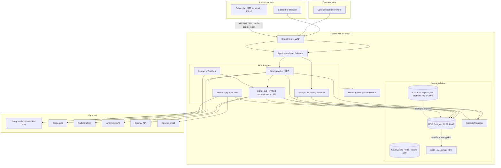
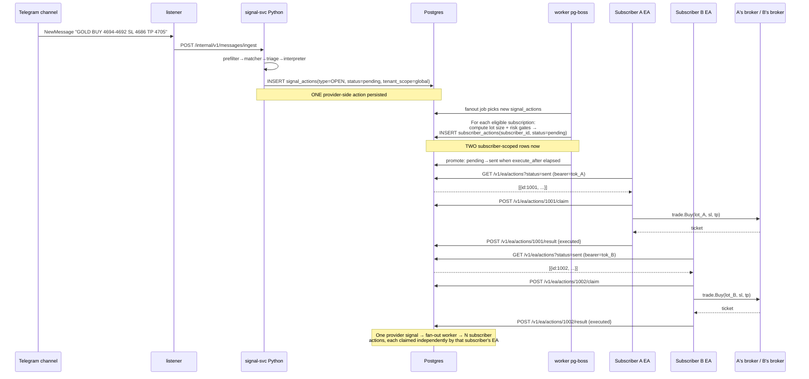

# 01 — Architectural Decisions

Every other document in this plan depends on the choices made here. Each section: options table, recommendation, rationale, reversibility cost.

Reversibility cost legend: **cheap** (1 sprint to reverse), **moderate** (1 quarter), **locked-in** (rewrite).

---

## 1. Execution Model — the most consequential decision

**The question**: how does a parsed action become an order on N subscriber broker accounts?

| Axis | Path A: Subscriber-installs-EA | Path B: Centralized MetaApi | Path C: Hybrid (A for MT5, B for cTrader) |
|---|---|---|---|
| Subscriber friction | High — install MT5, attach EA, paste token, allow WebRequest | Low — paste broker login in web form | Mixed |
| Operator broker-credential exposure | None (EA runs on subscriber's box, holds nothing) | Full (we hold MT5 login+password+server) | Partial |
| KYC weight | Low (we don't move money) | High (we're effectively a discretionary manager in many regs) | High |
| Vendor cost per subscriber at scale | $0 ongoing per sub | MetaApi: $0.59/account/mo at 100+ tier (verify); ~$1.49/account at lower tier | Same as B for cTrader subset |
| Latency floor | 1s EA poll + network to cloud | 50–200ms (MetaApi push) | mixed |
| Latency ceiling under load | Bounded — subscriber's local poll, parallel | MetaApi rate caps + serial dispatch from our service | mixed |
| Reconciliation responsibility | Per-EA (already solved) | Central service must reconcile N broker accounts | hybrid |
| Support burden | "did you allow WebRequest? is MT5 running?" | "your broker just locked your IP" | Both, no consolidation win |
| Failure blast radius | One subscriber's machine = one subscriber affected | Our service down = ALL subscribers stop trading | mixed |
| Broker coverage | MT5 only (the only place an EA runs) | MT5 + cTrader + DXTrade via vendor | broadest |
| Time-to-market | 4–6 weeks (port EA + add per-EA auth) | 8–12 weeks (account-linking UX + credential vault + central dispatcher + reconciler) | longest |
| Regulatory framing | "We deliver signals; the customer's machine executes" — closest to a publisher | "We manage execution on the customer's account" — closer to discretionary | both, harder story |
| Mass-rejection blast | Each subscriber's broker rejects independently | One bad signal → N parallel broker calls → potential vendor rate cap and IP block | A is safer |
| Subscriber trust signal | Lower — "I have to install software?" | Higher — "I link and go" | inconsistent |

**Recommendation: Path A (subscriber-installs-EA), with a managed-VPS-installer as the UX softener.**

**Rationale.** The existing EA is the IP we own — staged management policy, broker compatibility checks, reconciliation, retry queue, persistence to MT5 GlobalVariables, the 2026-05-27 dedup-by-action-id incident fix at `ea/CopyTrades.mq5:1461`. Path B throws all of that away and rebuilds it server-side in Python/TS, which is months of work and the failure modes will all be discovered live. Path A keeps the EA, replaces only its transport (loopback HTTP → mTLS to cloud), and gives us the cleanest regulatory story for launch: we publish signals; the subscriber's machine executes. The "subscriber must install MT5" friction is real but our target buyer (XAUUSD trader following an Arabic Telegram channel) already runs MT5 — installing an EA is the most common thing they do.

We soften the install friction with a **one-click VPS bundle** option: a managed VPS pre-provisioned with MT5 + our EA, owned in the subscriber's name with a broker template, billed as an add-on. This is operationally cheap (1 image, scriptable) and addresses the "I don't have a Windows box that's always on" objection.

**Switch trigger to Path B**: if 6 months post-launch our top churn reason is "couldn't install the EA". Then add MetaApi as a second execution backend (Path C).

**Reversibility cost**: **moderate**. We can add MetaApi as a parallel `BrokerBridge` implementation without retiring the EA path. The schema chosen in §3 must be bridge-neutral from day one (column `execution_backend ∈ {ea, metaapi, ctrader}` on `broker_connections`).

---

## 2. Hosting

| Option | Pros | Cons | Cost @ small scale |
|---|---|---|---|
| AWS | Mature, every vendor integrates, RDS+ElastiCache+ECS+KMS one-stop | Steepest learning, IAM sprawl, surprise bills | ~$200–400/mo baseline (verify) |
| GCP | Cloud Run is great, Cloud SQL solid | Smaller ecosystem for fintech tooling | ~$150–300/mo (verify) |
| Fly.io | Containers near subscribers, simple deploy, low ops overhead | Managed Postgres is OK but young; smaller scale ceiling; persistent-disk story is fine but DR is more DIY | ~$50–150/mo |
| Railway | Easiest DX | Not built for compliance posture or long-term scale | ~$30–100/mo |

**Recommendation: AWS (eu-west-1 or me-south-1 depending on §10 jurisdiction).**

**Rationale.** Copy-trading is regulated. We will eventually need SOC 2 attestations, BAA-equivalent agreements, and vendor evidence in compliance reviews. AWS is the path of least friction for that. KMS, IAM, RDS, ElastiCache, ECS Fargate, S3, CloudFront, Secrets Manager — all first-party. The premium over Fly.io at small scale (~$200/mo) is the cost of not migrating in year 2.

**Switch trigger to Fly.io**: if §10 picks BVI/Estonia and we'll never sell into US/UK and SOC 2 is not on the roadmap. Then Fly.io wins on DX and cost.

**Reversibility cost**: **moderate**. Container-first design keeps providers swappable; data layer (Postgres + S3) is portable. Identity (KMS, IAM) is the lock-in.

---

## 3. Primary data store

| Option | Pros | Cons |
|---|---|---|
| AWS RDS Postgres | Boring, predictable, IAM auth, PITR, read replicas, encryption at rest, BYO KMS | Cost floor (~$60/mo for db.t4g.medium, verify) |
| Cloud SQL | Same shape on GCP | GCP lock |
| Neon | Serverless, branching for dev/PR previews, cheap | Less mature for write-heavy workloads; cold-start concerns for the listener-driven write path |
| Supabase | Postgres + auth + storage in one | Couples DB choice to auth choice; we want separation |

**Recommendation: AWS RDS Postgres 16, Multi-AZ at launch.**

**Rationale.** Writes per action lifecycle transition are small but frequent and synchronous on the critical path. We need ACID + FK joins (audit chain), PITR (regulator-grade record keeping), and the schema in §3-DATA-MODEL has 25+ tables with cross-tenant queries that benefit from RLS or app-level enforcement on a real RDBMS. SQLite must die in production. We use Neon only for branch-per-PR dev/staging.

**Reversibility cost**: **cheap** at small data sizes. Postgres-to-Postgres dumps are trivial.

---

## 4. Business-layer stack

| Option | Pros | Cons |
|---|---|---|
| Next.js (app router) + tRPC + Drizzle + shadcn/ui | One repo, end-to-end types, fastest UI iteration, owner is JS native | tRPC is JS-only — Python signal pipeline cannot call it directly without a REST/gRPC adapter |
| Next.js + Prisma | Mature ORM, better migrations DX | Heavier runtime, slower cold starts |
| Hono + separate Next.js frontend | Cleanest separation, Hono runs anywhere | Two deploy targets, more boilerplate, no end-to-end type wins |
| Nest.js + Next.js | Enterprise feel, DI | Overkill at 2 engineers |

**Recommendation: Next.js 15 (app router) + tRPC + Drizzle + shadcn/ui + TanStack Query.** Hono mounted under `/api/v1/internal/*` for Python↔Node REST calls (the Python signal pipeline is not a tRPC client).

**Rationale.** Owner is a JS developer. Two engineers can ship the subscriber app, admin app, and internal REST endpoints out of one repo with end-to-end types. Drizzle migrations are SQL, which composes cleanly with the Postgres design in §3-DATA-MODEL. shadcn/ui is the right default for a fintech dashboard — owned components, not a CSS framework lock-in.

**Reversibility cost**: **cheap** for UI library, **moderate** for ORM, **locked-in** for tRPC-vs-REST architectural shape.

---

## 5. Signal pipeline language

**Keep Python.** This is non-negotiable per the user's constraints and right on its merits.

The interpreter `_TEMPLATE` in `src/ai.py` (~11 KB), the prompt-engineering harness, the 16 Pydantic action models in `src/validators.py`, the trigger matcher with embedding fallback, the signal memory, the fingerprint, the prefilter, the cost guard, the orchestrator's stage cascade — this is the IP. Porting LLM orchestration to TS would be 8–12 engineer-weeks of net-zero value with regression risk in the only component the product cannot launch without.

**Packaging**: FastAPI in a Docker container. One image, multiple replicas behind an internal ALB. The listener is a separate process in the same image (different command), not a separate codebase.

**Integration contract**: `signal-svc` exposes a small REST surface to the Node business layer (internal, mTLS):

- `POST /internal/v1/messages/ingest` — listener writes incoming Telegram messages here (replacing today's in-proc `process_message`). Returns `{message_id, actions: [{id, type, payload}]}`.
- `POST /internal/v1/replay` — operator-side replay of a historical message.
- `GET /internal/v1/health` — liveness + last-LLM-call timestamp.
- `POST /internal/v1/cost/budget` — operator updates per-tenant LLM budget.

The Node side never reaches into Python data structures. The Python service writes `messages`/`actions` rows directly to the shared Postgres (it's the writer; Node reads). This is the same shape as today (Python writes, GUI reads) just with Postgres in the middle.

**Reversibility cost**: **locked-in** for the language choice (the prompt is the moat).

---

## 6. Queue / worker system

| Option | Pros | Cons |
|---|---|---|
| Redis + BullMQ | Mature, great TS DX, retries/delays/repeat jobs out of the box | Need to operate Redis (or pay for ElastiCache ~$15/mo, verify) |
| Postgres-as-queue (pg-boss / Graphile Worker / River) | One less moving piece; transactional with the action lifecycle | Throughput ceiling around few-k jobs/sec; LISTEN/NOTIFY operational gotchas |
| SQS + Lambda | Cheap, infinitely scalable, no servers | Cold starts on the critical path; harder local dev |

**Recommendation: Postgres-as-queue via `pg-boss` for the business layer, and **no queue at all** for the EA fan-out path.**

**Rationale.** The hot path (signal → fan-out to N subscribers → EA pickup) is naturally pull-based: each subscriber's EA polls `GET /v1/ea/actions?status=sent` with its own bearer token. We don't need to push; the EA is the worker. The schema enforces lifecycle (`pending→sent→claimed→{executed|failed|rejected|watching}`) exactly as today. A queue would be a second source of truth.

Where we DO need queues: Stripe webhook processing, email send, KYC callbacks, audit-export generation, scheduled jobs (release-stale-claims, expire-stale-watches, promote-due-actions). These are all things pg-boss handles fine.

**Switch trigger to BullMQ**: when scheduled-job throughput crosses ~1k jobs/min sustained, or we need fan-out patterns pg-boss doesn't support well. Both ~12 months away.

**Reversibility cost**: **cheap**.

---

## 7. Billing

| Option | Pros | Cons |
|---|---|---|
| Stripe | Best DX, lowest fees (2.9% + 30¢), most coverage | We handle sales tax / VAT registrations ourselves; not a merchant of record |
| Paddle | Merchant of record — handles VAT/tax/GST globally | Higher fees (5–10% effective at small scale, verify); slightly worse DX |
| Lemon Squeezy | MoR like Paddle, simpler | Smaller, less mature for subscription dunning |

**Recommendation: Paddle as merchant-of-record for v1.**

**Rationale.** Sales tax / VAT compliance across our target geographies (MENA, SEA, LatAm; see §10) is a separate engineering project we don't want. Paddle eats those problems for ~3–5% extra. At 100 paying subs × $99/mo ARPU = ~$10k MRR, the Paddle premium is ~$300/mo — cheaper than a part-time tax accountant. When we cross ~$50k MRR and need finer revenue-recognition control, migrate to Stripe + Stripe Tax. Paddle → Stripe is a multi-week project but not a rewrite; the billing tables in §3-DATA-MODEL are processor-agnostic.

**Pricing model**:

| Tier | Price | Subscriber gets |
|---|---|---|
| Starter | $39/mo | 1 broker connection; up to $5k account size; standard latency; email support |
| Pro | $99/mo | 3 broker connections; up to $50k account size; priority signal delivery (parallel); Telegram alerts; chat support |
| Elite | $249/mo | 10 broker connections; unlimited account size; per-trade Telegram + email + webhook; phone support |

Add-on: **Managed VPS** $19/mo per connection.

No profit-share, no per-trade pricing for v1 — both are metering nightmares and create perverse incentives the channel didn't sign up for.

**Reversibility cost**: **moderate**. Subscription state in Postgres is processor-neutral; the migration project is real but bounded.

---

## 8. Auth

| Option | Pros | Cons |
|---|---|---|
| Clerk | Best DX, drop-in UI, organizations included, MFA, social, magic links | Per-MAU pricing; vendor lock-in for user data; sub-processor in privacy posture |
| Auth0 | Enterprise pedigree, every flow imaginable | Expensive ramp, heavy UI to override |
| WorkOS | B2B-strong, SSO, directory sync | Pricier; B2C feels like a side-door |
| Supabase Auth | Cheap, integrated if we used Supabase Postgres | We're not on Supabase; brings dependencies we don't want |
| Lucia + Postgres | Owned, free, no vendor | We build every flow — MFA, magic link, recovery, OAuth, lockout — and ship the bugs |

**Recommendation: Clerk.**

**Rationale.** Two engineers cannot also be an auth team. Clerk gives us email/password + Google + Apple + MFA + magic links + bot-protection + a working session UI in week 1, with organizations free for the future B2B path (signal-provider partnerships). The per-MAU pricing maths fine until ~10k users. User identity stays in Clerk; the Postgres `subscribers` table joins by `clerk_user_id` and stores only our domain data. We export user data weekly to S3 as our portability hedge.

**Switch trigger**: if we hit Clerk's enterprise pricing wall (~$25k/year) we move to a self-hosted Lucia + WorkOS-for-SSO hybrid. ~6 weeks of work, well-scoped.

**Reversibility cost**: **moderate** because users would have to re-verify email, but no data is lost (we own the join column).

---

## 9. Secret management

The DPAPI Windows-bound approach in `src/secret_box.py` does not survive into the cloud. Replace it.

| Option | Pros | Cons |
|---|---|---|
| AWS KMS + Secrets Manager | Native, IAM-scoped, audit-logged, KMS-CMK for envelope encryption | Per-secret monthly cost (~$0.40, verify); only AWS |
| HashiCorp Vault | Best-in-class, dynamic secrets, transit encryption | Operational overhead — we run it |
| Doppler | Great DX, central UI, env-var injection | Vendor in the secret path, adds an attacker surface |
| Infisical | Open-source Doppler-alike | Younger ecosystem |

**Recommendation: AWS Secrets Manager for app secrets + AWS KMS for envelope encryption of subscriber-provided secrets (broker tokens, Telegram bot tokens, encrypted at the application layer with a per-tenant KEK).**

**Rationale.** We're on AWS (§2). The secrets that matter at scale are the subscriber-provided ones (one row per subscriber × 3 broker connections at the Pro tier = thousands of secrets). Storing each in Secrets Manager is wrong (1k secrets × $0.40 = $400/mo for storage alone). Pattern: application-layer envelope encryption — a per-tenant KEK from KMS encrypts each row's DEK, and the encrypted DEK + ciphertext live in Postgres. App secrets (Stripe API key, Anthropic key, Clerk secret, etc.) live in Secrets Manager.

**Reversibility cost**: **moderate**.

---

## 10. Jurisdiction & launch geography

| Option | Crypto/copy-trading regulator stance | Tax | Banking | Setup cost / time |
|---|---|---|---|---|
| UAE (DIFC / ADGM) | Friendly; ADGM has bespoke crypto/fintech regimes; copy-trading is regulated but pathways exist | 9% corporate tax above ~$100k; 0% personal | Good banking |~$30k + 3–6 mo |
| Cyprus (CySEC) | EU passport; copy-trading via CIF | 12.5% corp | EU banking | ~€40k + 6 mo; ongoing capital req |
| BVI | Light-touch; broker dealer license possible | 0% | Banking has been getting harder for fintech | ~$15k + 6–8 weeks |
| Estonia (EFSA) | EU passport; e-residency | 0% on retained earnings | OK banking | ~€10k + 2–3 mo |
| US (any state) | FINRA registration for any "investment advice" framing | Federal + state | Easy banking | $100k+ + 12+ months |
| UK | FCA permission required | 19% corp | Good banking | $100k+ + 12+ mo |

**Recommendation: UAE — ADGM (Abu Dhabi Global Market) "FinTech RegLab" or a category-3C/4 license depending on framing.**

**Rationale.** Channel is Arabic (Forex Engineer); target audience is MENA-resident retail; banking and tax are good; ADGM has explicit pathways for fintech-issued investment information that don't require a full broker-dealer license. The "we publish signals; the customer's machine executes" framing (Path A from §1) lands clean in ADGM. Runner-up: BVI for cost/speed if MENA banking proves slow.

**Day-1 geo-block**:

- **US, US territories** — full block (Reg-S, FINRA, state licensing all bite)
- **Canada, Australia, NZ** — block until we have a partner counsel review
- **EEA + UK + Switzerland** — block until we either passport via Cyprus or partner with an EU-licensed entity (MiFID II "investment advice" framing risk)
- **Iran, North Korea, Syria, Cuba, OFAC SDN list** — full block
- **China** — block (Forex margin trading is illegal for retail)

That leaves: MENA (except sanctioned), South America (subject to KYC per country), SE Asia (subject to per-country review), Africa (subject to per-country review), India (subject to RBI overseas trading guidance — block until counsel reviews). This is enough TAM for the 10–50 sub MVP.

**Reversibility cost**: **locked-in** for the incorporation choice; **moderate** for which geos we serve (just toggle flags + tax math).

---

## System topology (Mermaid)

---

## Sequence: signal → 2 subscribers execute

---

## Pre-decision summary

| # | Decision | Choice | Reversibility |
|---|---|---|---|
| 1 | Execution model | Path A — subscriber EA + cloud API + optional managed VPS | moderate |
| 2 | Hosting | AWS eu-west-1 (or me-south-1) | moderate |
| 3 | Data store | RDS Postgres 16 Multi-AZ; Neon for dev branches | cheap |
| 4 | Business stack | Next.js 15 app router + tRPC + Drizzle + shadcn/ui | mixed |
| 5 | Signal pipeline | Keep Python; FastAPI container; REST contract to Node | locked-in |
| 6 | Queue | pg-boss; no queue on EA hot path | cheap |
| 7 | Billing | Paddle (MoR) v1; Stripe later | moderate |
| 8 | Auth | Clerk | moderate |
| 9 | Secrets | KMS envelope encryption in Postgres + Secrets Manager for app secrets | moderate |
| 10 | Jurisdiction | ADGM (UAE); geo-block US/CA/AU/NZ/EEA/UK/CN/sanctioned day-1 | locked-in (incorporation) |
