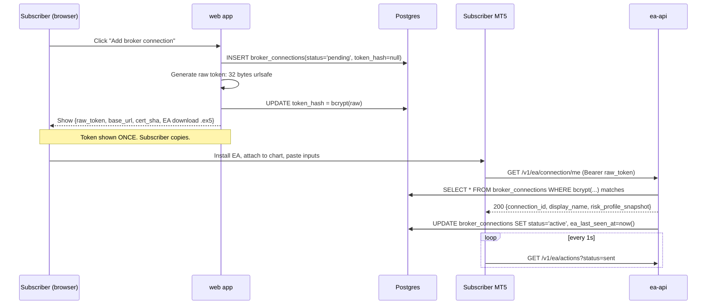
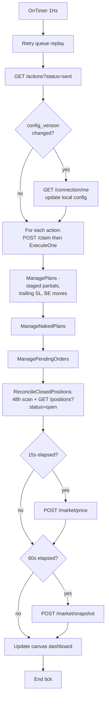

# 04 — Execution Layer

Per §1 of `01-ARCHITECTURAL-DECISIONS.md`, the chosen execution model is **Path A: subscriber-installs-EA**, plus an optional managed VPS bundle for friction relief. This document specifies the design.

---

## EA v2 — what changes from today

The existing EA (`ea/CopyTrades.mq5`, ~4100 LOC) survives almost intact. Specifically:

**Preserved verbatim**:
- `OnTimer` polling cadence (1 Hz default)
- `ExecuteOne` dispatcher and all `Do*` handlers (13 cases)
- `ManagePlans()` — the staged-management state machine (TP1/TP2/TP3 partial-close ladders, trailing SL at 1.5×ATR(M15,14), `TrueBreakEvenSl`, `SignalAnchorSl`, progressive-ladder synthesis for 1-TP signals)
- `ManageNakedPlans()` — OPEN_INSTANT → ATTACH_SIGNAL timeout policy
- `ManagePendingOrders()` — broker BuyLimit/SellLimit lifecycle
- `ReconcileClosedPositions()` — 48h history scan + DB-authoritative pass via `GET /positions?status=open`
- `HeartbeatMarketPrice()` — unconditional 15s POST, even when paused (so subscriber's prompt-side STALE marker doesn't flip during a halt)
- `RegisterPlan` dedup-by-ticket guard (`ea/CopyTrades.mq5:1732`)
- `DoOpen` dedup-by-action-id guard against `g_pending_orders[]` (`ea/CopyTrades.mq5:1461`) — the 2026-05-27 incident fix
- Retry queue via `MQL5\Files\` for failed POSTs
- Persistence to `GlobalVariables` for `g_plans[]`, `g_pending_orders[]`, naked positions
- Broker capability check via `ea/BrokerCheck.mqh` on `OnInit`
- Canvas dashboard (`ea/Dashboard.mqh`) — repurposed to show the subscriber-facing connection status

**Replaced**:
- **Transport**: `WebRequest()` against `http://127.0.0.1:8765` → `WebRequest()` against `https://ea-api.copytrades.example.com` with HSTS + cert pinning (a single hardcoded `ApiCertSha256` input). MQL5's WebRequest does TLS via WinHTTP since build ~2300 (verify); cert pinning at the EA layer prevents MITM via a compromised root CA.
- **Auth**: `X-EA-Token: <shared>` → `Authorization: Bearer <per-EA token>`. Token issued once on broker-connection creation, hashed (bcrypt) in `broker_connections.ea_bearer_token_hash`, raw token shown to subscriber exactly once with copy-to-clipboard instructions. Token rotation is a button in the subscriber web app (revokes old, issues new, surfaces new in the EA's input panel via a small download-config UX).
- **Endpoint paths**: `/actions?status=sent` → `/v1/ea/actions?status=sent`. Auth context resolves `broker_connection_id` from the bearer; the EA queries that connection's actions only — server-side filter, no client-side scoping needed.
- **Idempotency**: every POST that mutates carries `Idempotency-Key: <sha256(action_id || token_hash || attempt_n)>`. Server stores keys for 24h and short-circuits duplicates.
- **mTLS**: optional in v1 (bearer-only over TLS is sufficient); v2 adds client certs issued from a private CA for elite-tier subscribers who want it.

**New EA inputs**:
- `ApiBaseUrl` (default `https://ea-api.copytrades.example.com`)
- `ApiBearerToken` (per-EA, copy from web app)
- `ApiCertSha256` (cert pinning — single fingerprint string)
- `ConnectionDisplayName` (for the dashboard widget — purely cosmetic)

---

## Per-EA authentication & onboarding flow

---

## Server-side staged-management policy — does it move?

**No.** The staged-management policy (TP1/TP2/TP3 partials, trailing SL at 1.5×ATR, BE moves, progressive ladder synthesis) stays in the EA.

Rationale:
1. The policy needs broker-side context only the EA has: current bid/ask with sub-second freshness, broker's filled volume, retcode semantics, ATR computed against the broker's M15 OHLC.
2. Centralizing it server-side would mean the server holds 100 separate state machines (one per subscriber's open position), each driven by EA-pushed tick data — that's a 10× increase in inbound POSTs and a state-machine bug we already shipped twice (RegisterPlan dedup; pending dedup-by-action-id).
3. The EA already persists in-flight plans to `GlobalVariables`, so it survives MT5 restarts. Moving the state machine to the server means re-replicating that.

What MOVES server-side from today's design:
- Per-subscriber risk gates (lot sizing, instrument allowlist, drawdown stop, time-of-day filter) — these run in the **fan-out worker** before `subscriber_actions` are even written. The EA doesn't see signals that fail risk gates.
- The chase-price decision threshold (`ChaseMinRewardRatio`) is still EA-side because it needs live price; but the boolean `chase_price_enabled` is fetched from `risk_profiles` on EA startup and on subscriber-edit (pushed via a server-side `connection_config_version` the EA polls in the GET actions response).

---

## EA-facing API surface (`apps/ea-api`)

All routes under `/v1/ea/`. Bearer auth resolves a single `broker_connection`. RLS-bypass service role on Postgres.

| Method | Route | Purpose | Idempotent |
|---|---|---|---|
| GET | `/v1/ea/connection/me` | Connection bootstrap + current `risk_profile` snapshot + `connection_config_version` | yes |
| GET | `/v1/ea/actions?status=sent&limit=50` | Poll work queue scoped to this connection | yes |
| POST | `/v1/ea/actions/{id}/claim` | Atomic `sent → claimed` | yes (no-op on second call) |
| POST | `/v1/ea/actions/{id}/result` | Terminal post: `{status, mt5_ticket?, snapshot?, legs?, error?}`, `Idempotency-Key` required | yes (via idempotency key) |
| GET | `/v1/ea/actions/{id}` | Detect server-side cancellation of a watching pending | yes |
| GET | `/v1/ea/positions?status=open` | Reconciliation oracle (scoped to connection) | yes |
| POST | `/v1/ea/positions/{ticket}/update` | `{volume?, sl?, tp?, realized_pnl_delta?}` | yes (bookkeeping is monotonic) |
| POST | `/v1/ea/positions/{ticket}/attach_signal` | OPEN_INSTANT → ATTACH_SIGNAL wiring | yes |
| POST | `/v1/ea/positions/{ticket}/close` | Final close | yes |
| GET | `/v1/ea/positions/last_closed?symbol=&within_hours=` | REOPEN_LAST / REINFORCE source-params (scoped) | yes |
| GET | `/v1/ea/positions/by_ticket/{ticket}` | REINFORCE pre-close snapshot | yes |
| POST | `/v1/ea/market/price` | `{symbol, bid, ask}` 15s heartbeat | yes |
| POST | `/v1/ea/market/snapshot` | OHLC+ATR 60s | yes |
| POST | `/v1/ea/alerts` | EA escape hatch | no — append-only |
| POST | `/v1/ea/account/snapshot` | NEW: `{balance, equity, margin, currency}` every 60s — drives equity-proportional sizing | yes |
| POST | `/v1/ea/health` | `{ea_version, mt5_build, broker_company, ping_ms}` every 5 min | yes |

Note `/v1/ea/account/snapshot` is new — central service needs to know subscriber's account size to compute lot sizing in the fan-out worker. The EA reads `ACCOUNT_BALANCE`/`ACCOUNT_EQUITY` once a minute and POSTs.

Auth failures: 401 with `{error: "invalid_token", action: "revoked|expired|never_existed"}`. The EA dashboard surfaces `action` to the subscriber so they know whether to refresh or contact support.

---

## Fan-out — the new bit (one signal → N subscriber_actions)

See `05-SIGNAL-FANOUT.md` for the full design. In summary:

1. Python `signal-svc` writes one `signal_actions` row.
2. A pg-boss job `fanout_signal_action` fires.
3. For each `subscriber_channel_subscriptions WHERE signal_provider_id=...`, the worker resolves the subscriber's `broker_connection`, applies risk gates, computes per-subscriber lot size from `risk_profile` + last-known `account_balance`, and writes `subscriber_actions` (`status='pending'` or `'skipped'` with a reason).
4. The promoter sweeper (running in `apps/worker`) flips `pending → sent` when `execute_after` elapsed.
5. Each subscriber's EA polls and claims as today.

The critical guarantee: **fan-out is idempotent**. The unique constraint `(signal_action_id, broker_connection_id)` on `subscriber_actions` means a worker retry cannot create duplicates.

---

## Reconciliation — equivalent of ReconcileClosedPositions in the new world

Two layers, both essential.

**Layer 1 — EA-side, per-subscriber (preserved verbatim)**:
- 48h `HistorySelect` + `HistoryDealsTotal` + `DEAL_ENTRY_OUT` scan, every `OnTimer` tick.
- DB-authoritative pass: `GET /v1/ea/positions?status=open`; any ticket MT5 doesn't recognize → `POST /v1/ea/positions/{ticket}/close` with `reason='mt5_not_found'`.
- Same throttle policy (none — must converge in one tick).

**Layer 2 — server-side cross-checking (new)**:
- Worker job `reconcile_position_freshness` runs every 5 min.
- For each `positions WHERE status='open' AND broker_connection.ea_last_seen_at > now() - interval '2 min'`: if `opened_at < now() - 24h` AND no `/positions/{ticket}/update` POST in the last 30 min, raise an `audit.api_errors`-side stale-position alert. This catches the case where the EA is alive (heartbeats arriving) but its `ReconcileClosedPositions` somehow failed to detect a broker close.
- Worker job `quarantine_dead_connections` runs every minute: for each `broker_connections WHERE status='active' AND ea_last_seen_at < now() - interval '5 min'`: send subscriber notification (channel=email + telegram); after 30 min flip `status='disabled'` with reason `'ea_silent_5min'`; fan-out worker excludes disabled connections from then on.

---

## Failure handling and retry

| Failure | Detection | Recovery |
|---|---|---|
| Broker rejects OrderSend | EA `trade.ResultRetcode()` | EA POSTs `failed` with retcode error; signal lifecycle ends `failed`; subscriber notified |
| Network blip EA→cloud | `WebRequest` returns false / non-2xx retryable | EA enqueues to `MQL5\Files\`; next tick retries; idempotency key ensures no double-execute on result POST |
| Subscriber's MT5 stopped | No `ea_last_seen_at` heartbeat | `quarantine_dead_connections` worker disables connection at +30 min; subscriber emailed + Telegram-DM'd at +5 min and +30 min |
| Subscriber's bearer token revoked mid-run | EA gets 401 with `revoked` | EA shows dashboard banner; subscriber re-pastes new token from web app |
| `subscriber_actions` stuck in `claimed` (EA died between claim and result) | Worker `release_stale_claims` every 15s flips `claimed → sent` after 300s with `claimed_by_token_hash=null` | EA on next poll re-claims and re-attempts; idempotency key ensures the previous-attempt's late result POST cannot overwrite the new claim |
| Duplicate broker order for one signal (the 2026-05-27 case) | The EA dedup-by-action-id guard at `ea/CopyTrades.mq5:1461` blocks at the EA layer; the server-side status-guarded `post_result` blocks the audit row | EA logs the dup, posts a single `failed` row with `error='duplicate_broker_order'` |
| Fan-out worker crashes mid-fanout | `signal_actions.fanout_completed_at IS NULL` job restart | Worker idempotent on `(signal_action_id, broker_connection_id)` UNIQUE; resumes safely |
| `signal-svc` crash mid-orchestrate | Telethon backfill on listener restart replays missed messages | `messages.UNIQUE(signal_provider_id, tg_chat_id, tg_message_id)` prevents reprocessing |
| LLM provider outage | `orchestrator` falls back to ALERT-only action (current code) | Subscribers receive ALERT via notifications; no auto-trade fires |
| Subscriber broker rate-limits (a single broker shared by many subscribers) | EA-side retcode | Per-subscriber failure; no platform-wide blast |
| Mass broker reject (broker outage) | Spike in `failed` results across connections | New alert: worker `detect_mass_failure` — when `subscriber_actions.status='failed'` rate > 50% in 5 min, page on-call (PagerDuty), auto-halt the affected provider |

---

## Configuration push to EA (no EA restart)

When subscriber edits risk_profile in the web app, we must NOT require the subscriber to re-attach the EA. Pattern:

- `broker_connections.config_version` (integer, increments on any related-row update — via Postgres trigger).
- `GET /v1/ea/actions` response includes `connection_config_version` in every response.
- EA caches local `last_seen_config_version`; on mismatch, EA calls `GET /v1/ea/connection/me` to refetch risk snapshot.
- Risk-relevant inputs the EA cares about: `chase_price_enabled`, `chase_min_reward_ratio`, `enable_instant_open`, `enable_reinforce`, `enable_ai_partial_and_be`, `max_lots_per_signal`, `instrument_allowlist`.
- Lot sizing is computed server-side in the fan-out worker, not EA-side, so changes there take effect for the NEXT signal automatically.

---

## What does NOT survive into the EA v2

- Direct DB access (no SQLite to talk to)
- DPAPI / Windows registry
- NSSM service hooks
- The "stack" concept (the EA serves one `broker_connection`, not a stack)
- `Magic = 919191` as a global default — magic number derived from `broker_connection_id` (e.g., `900000 + connection_id`) so multiple EAs on one account don't collide (Pro tier allows that)
- Profile JSON local cache — the EA doesn't see profile content; the cloud renders prompts

---

## Distribution

- `ea/CopyTrades.ex5` built by `MetaEditor64` via CI on a Windows GitHub Actions runner.
- Signed `.ex5` is published to S3 with versioning.
- Subscriber web app shows a "Download EA v2.3.1 for MT5" button that fetches from S3 + a per-subscriber URL that returns a personalized README with their `connection_id` baked in.
- Auto-update: EA POSTs its version in `/v1/ea/health`; cloud returns `latest_version` in the response. EA logs an "update available" banner on the canvas dashboard with a one-line `Tools > Open Data Folder` reminder. No silent self-update (MetaTrader's security model doesn't allow `.ex5` overwrites by a running EA without ToTerminal copy + chart re-attach; we accept the manual step).
- For managed VPS bundles, a Windows AMI on AWS is pre-baked with MT5 + EA + a startup script that pulls the latest `.ex5` and the subscriber's per-EA config from a one-time-use signed S3 URL.

---

## Mermaid: EA v2 control flow (single tick)

