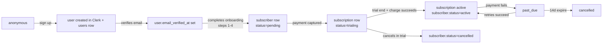

# 07 — Billing and Identity

## Billing — Paddle (merchant of record) for v1

Per §7 of `01-ARCHITECTURAL-DECISIONS.md`. Paddle handles VAT/sales-tax across our launch geos; we pay ~3–5% on top of card fees and skip the tax engineering project. Migrate to Stripe + Stripe Tax when MRR justifies the swap (~$50k MRR threshold).

### Pricing model

Flat monthly subscription, three tiers, plus one add-on.

| Tier | Price | Broker connections | Account size cap | Notifications | Support | Risk-profile UI |
|---|---|---|---|---|---|---|
| Starter | $39/mo | 1 | $5,000 | email + in-app | email (48h) | basic |
| Pro (recommended) | $99/mo | 3 | $50,000 | + Telegram + priority delivery | chat (24h) | full |
| Elite | $249/mo | 10 | unlimited | + webhook + per-trade phone alert opt-in | phone (4h) | full + per-broker overrides |

Add-on: **Managed VPS bundle** $19/mo per broker connection (covers the AWS-side cost for a Windows micro instance + MT5 license at the cheapest broker that allows it).

**Trial**: 14-day free, card required, no charge until trial end. Cancel anytime during trial.

**No profit-share, no per-trade pricing.** Both create perverse incentives the channel did not opt into and are metering nightmares. We can layer a "Pro+ revenue share" tier in year 2 if data supports it.

### Plan feature gating

`plans.features_json`:
```json
{
  "max_broker_connections": 3,
  "max_account_size_cents": 5000000,
  "channels_available": ["forex-engineer"],
  "notification_channels": ["email","telegram","inapp"],
  "support_tier": "chat_24h",
  "risk_profile_advanced": true,
  "managed_vps_eligible": true,
  "priority_signal_delivery": true
}
```

Enforced at:
- Broker creation: `brokers.create` checks count vs `max_broker_connections` and returns 402 with upsell.
- EA execution: the fan-out worker checks `account_balance_cents <= max_account_size_cents`; if exceeded, `subscriber_actions.status='skipped'` with `skipped_reason='account_size_exceeds_plan'` and notification sent.
- Notification dispatch: only enabled channels are written; UI surfaces "Telegram alerts (Pro)" upsell on Starter.

### Paddle integration touchpoints

1. **Checkout** — `billing.subscription.changePlan` returns a Paddle hosted-checkout URL. We pass `customData={ subscriber_id }`.
2. **Webhook** — `POST /api/webhooks/paddle` (Hono route) verifies signature → enqueues pg-boss job `process_paddle_event`. Job is idempotent on `paddle.event_id`. Events we care about: `subscription.created`, `subscription.updated`, `subscription.cancelled`, `subscription.paused`, `subscription.resumed`, `transaction.completed`, `transaction.payment_failed`, `subscription.past_due`.
3. **Reconcile** — daily pg-boss job `reconcile_paddle_subscriptions` pulls Paddle's subscription list and compares to our `subscriptions` table; surfaces drift in `admin/billing`.
4. **Dunning** — Paddle handles the email cadence; we react to `past_due` by emailing the subscriber (overlapping fine) AND setting `subscribers.status='past_due'`. After 14 days past_due → auto-cancel.
5. **Refunds** — admin issues via `admin.subscribers.refund`; we proxy to Paddle's refund API; result logged to `audit.admin_actions`.
6. **Proration** — on plan change, Paddle handles prorated invoice; we trust the event payload.
7. **Cancellation** — `billing.subscription.cancel` sets `cancel_at_period_end=true`; subscriber retains access until `current_period_end`. Hard cancel = immediate via support flow only.

### Chargeback handling

Paddle handles initial dispute. On `subscription.cancelled` with reason `chargeback`: subscriber immediately to `status='banned'`, all broker connections to `status='revoked'`, EA bearer tokens invalidated. Subscriber's `users.role` does NOT change — they remain in the system for audit; they cannot create a new subscription on the same email.

---

## Identity — Clerk

### Configuration

- **Email/password** with min strength + bcrypt-with-pepper (Clerk-managed)
- **OAuth**: Google + Apple. (Facebook explicitly NOT — privacy posture.)
- **MFA**: TOTP optional on Starter; required for Pro+; required for `role IN ('admin','support')` always.
- **Magic links** as alternative to password.
- **Bot protection**: Clerk's built-in.
- **Session lifetime**: 30 days idle, 90 days max; admin sessions 8h idle, 24h max.
- **Account lockout**: 10 failed attempts in 5 min → 30 min lockout (Clerk default).

### User → Subscriber lifecycle



### Session tokens & access

- Clerk JWT → tRPC middleware verifies → attaches `ctx.user`.
- Postgres connection per request from a pool; `SET LOCAL app.subscriber_id = X` inside the request transaction. RLS policies use `current_setting('app.subscriber_id')::bigint`.
- Admin-tier reads: connect as `app_admin` role (RLS bypass for whitelisted tables).
- Internal service-to-service (Python ↔ Node, worker → DB): mTLS + service-role DB user (RLS bypass entirely).

### Roles & RBAC

| Role | What they can do |
|---|---|
| `subscriber` | own data only (RLS) |
| `support` | read-only across all subscribers, can pause/resume, cannot edit billing or providers |
| `admin` | everything except destructive provider-profile rollbacks (extra confirmation) |
| `readonly` | dashboards + audit only — auditor/investor access |

All admin actions logged to `audit.admin_actions` with IP + UA.

---

## KYC — conditional on jurisdiction

### When KYC is required

Per §9-COMPLIANCE-AND-LEGAL.md and the ADGM choice in §10 of 01:

- **Not required at signup** for v1 — the product framing is "signal publication" and our path-A execution model means we never touch subscriber money.
- **Triggered at $X spend or $Y account size** (TBD with counsel): if a subscriber's broker `account_balance_cents > $25,000` USD-equivalent OR they purchase the Elite tier → KYC flow.
- **Triggered by jurisdiction**: subscribers from countries on our amber list (per §9) get KYC at signup; subscribers from green list get KYC at the threshold above.

### KYC provider

**Recommendation: Persona** for v1. (Sumsub is the runner-up; Veriff is third.)

| Vendor | Pros | Cons |
|---|---|---|
| Persona | Best DX, generous free tier (~1,000/mo), policy templates for fintech | Pricing escalates ($2–5/verify above tier) |
| Sumsub | Best emerging-markets coverage (MENA strong) | Heavier UI, longer integration |
| Veriff | Fast, EU-focused | Less emerging-markets depth |

For our MENA-first launch, Persona's "Government ID + selfie + liveness + address proof + AML watchlist screening" template is sufficient.

### KYC flow

1. Trigger event fires → `subscribers.kyc_status='pending'` + Persona "inquiry" created → subscriber sees blocking banner with "Verify identity" CTA.
2. Subscriber completes Persona flow → webhook → `subscribers.kyc_status='approved'` or `'rejected'`.
3. Rejected → subscriber sees rejection reason; support ticket auto-created; account paused; refund issued at admin discretion.
4. Approved → `kyc_provider_ref = <persona.inquiry_id>` stored for 7 years (audit).

KYC data stays in Persona — we hold only the reference + status. GDPR delete requests propagate to Persona via their API.

### AML / sanctions screening

Persona's "AML watchlist screening" runs at KYC time AND a monthly batch rescreen via Persona's API. Hits → admin queue → manual review → freeze + report per §9.

---

## Email + password reset

Clerk handles email verification + password reset + magic link templates. We override the templates to match brand. Email transport for Clerk's flows: Clerk's own (Mailgun-backed). For our transactional/lifecycle emails: Resend (§8-COMMUNICATIONS.md).

---

## Audit + GDPR for identity

- `sessions` mirrors Clerk session metadata for our own audit search.
- "Active sessions" view in `/settings/security` listing IP, UA, last-active.
- Right-to-erasure → `subscribers.me.requestDelete` flow:
  1. Confirmation email with token.
  2. On confirm: `subscriber.deleted_at = now()`, `subscription.cancel_at_period_end=true`, broker connections revoked.
  3. PII in `users` (email, full_name, country) scrubbed at +30d (a window for chargeback disputes); `users.email` becomes `deleted_<id>@redacted.local`.
  4. Clerk user deleted at +30d via Clerk's deletion API.
  5. Operational data (`messages`, `subscriber_actions`, `positions`, `audit.*`) retained 7 years per regulatory record-keeping; subscriber's identifying join columns remain but PII is scrubbed.
- Right-to-access → async export job (`pg-boss` job, ~minutes) bundles all subscriber-scoped rows as JSON + CSV, encrypts with subscriber's email-verified PGP key OR delivers a time-limited signed S3 URL. Email notifies on completion.

---

## Cost notes

| Item | At 100 subs | At 500 subs | At 2000 subs |
|---|---|---|---|
| Clerk MAU pricing | ~$25/mo (Pro plan) | ~$100/mo (verify) | ~$400/mo |
| Paddle effective rate | ~5% of revenue | ~5% of revenue | ~4% (volume discount, verify) |
| Persona KYC | $0 (free tier covers ~1k/mo verifies) | ~$200/mo | ~$500/mo |
| Clerk MFA / advanced features | included Pro | included | enterprise quote |

Verify all figures with current vendor pricing before commit.
