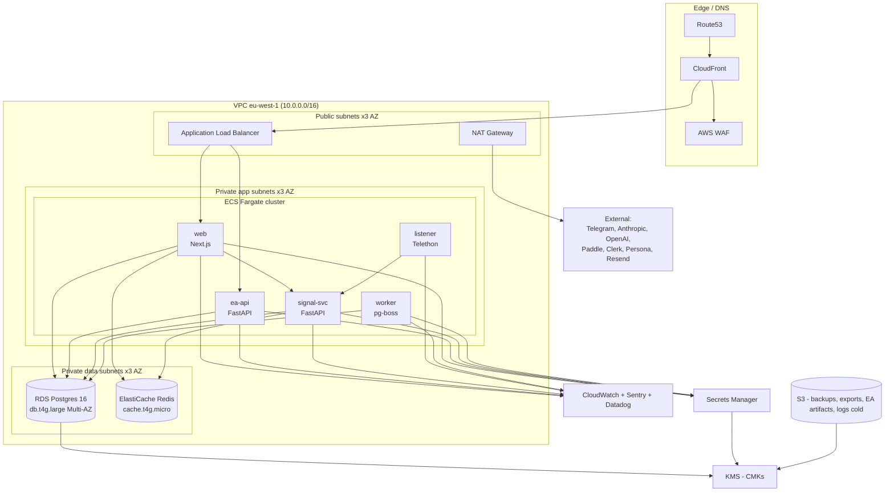

# 10 — Infrastructure

AWS, single region at launch (`eu-west-1` Ireland; switch to `me-south-1` Bahrain if ADGM counsel + latency tests favor it). Container-first. Terraform-managed.

---

## Cloud topology



### Resource catalog (launch sizing)

| Resource | Type | Count | Est. cost/mo (verify) |
|---|---|---|---|
| RDS Postgres 16 db.t4g.large Multi-AZ + 100GB gp3 | managed | 1 | ~$200 |
| ElastiCache Redis cache.t4g.micro | managed | 1 | ~$15 |
| ECS Fargate tasks (web 2× 0.5vCPU/1GB) | container | 2 | ~$40 |
| ECS Fargate tasks (ea-api 2× 0.5vCPU/1GB) | container | 2 | ~$40 |
| ECS Fargate tasks (signal-svc 1× 1vCPU/2GB) | container | 1 | ~$30 |
| ECS Fargate tasks (listener 1× 0.25vCPU/0.5GB) | container | 1 | ~$10 |
| ECS Fargate tasks (worker 1× 0.5vCPU/1GB) | container | 1 | ~$20 |
| ALB | managed | 1 | ~$25 |
| NAT Gateway + data | managed | 1 | ~$45 |
| Route53 + CloudFront + WAF | managed | 1 | ~$25 |
| S3 (backups + exports + EA artifacts + logs cold) | managed | n/a | ~$10 |
| Secrets Manager (~20 secrets) | managed | n/a | ~$8 |
| KMS (CMKs) | managed | 4 | ~$4 |
| **Subtotal AWS** | | | **~$470/mo** |

External vendors monthly (independent of AWS):

| Vendor | At 0 subs | At 50 subs | At 500 subs | At 2000 subs |
|---|---|---|---|---|
| Anthropic (signal interpreter) | $0–10 | $20–60 | $100–300 | $400–1000 (verify) |
| OpenAI (triage / fallback) | $0–5 | $5–15 | $30–80 | $100–300 (verify) |
| Clerk | $0 | $25 | $100 | $400 |
| Paddle | 0 + fee | ~5% of revenue | ~5% | ~4% |
| Persona | $0 | $25 | $200 | $500 |
| Resend | $0 | $20 | $20 | $80 |
| Sentry | $0 | $26 | $80 | $200 |
| Datadog (logs+APM essentials tier, verify) | $0 | $50 | $200 | $600 |
| Cloudflare (Pro plan) | $20 | $20 | $20 | $200 (Business if needed) |
| PagerDuty (Pro, 5 seats) | $0 | $90 | $90 | $200 |
| **External subtotal** | ~$20 | ~$280 | ~$1,070 | ~$2,600+ |
| **Grand total infra+vendor** | ~$490 | ~$750 | ~$1,540 | ~$3,100+ |

At 100 paid subs × $99 ARPU = $9,900 MRR → margin healthy.
At 500 subs × $99 = $49,500 MRR → margin excellent.

ALL FIGURES marked **verify** before committing to a budget.

---

## CI / CD pipeline

GitHub Actions. One workflow per app, plus a shared "deploy" workflow.

```yaml
# Sketch — apps/web/.github/workflows/web.yml
on:
  pull_request: { paths: ['apps/web/**', 'packages/**'] }
  push: { branches: [main], paths: ['apps/web/**', 'packages/**'] }

jobs:
  lint-typecheck-test:
    runs-on: ubuntu-latest
    steps:
      - checkout
      - setup pnpm + node 20
      - pnpm install --frozen-lockfile
      - pnpm -F web lint
      - pnpm -F web typecheck
      - pnpm -F web test
      - pnpm -F web build

  e2e:
    needs: lint-typecheck-test
    if: github.event_name == 'pull_request'
    runs-on: ubuntu-latest
    steps:
      - Playwright against preview deploy (Vercel preview OR ephemeral ECS)

  build-and-push:
    needs: lint-typecheck-test
    if: github.ref == 'refs/heads/main'
    runs-on: ubuntu-latest
    steps:
      - configure AWS credentials via OIDC
      - docker build -t web .
      - docker push to ECR
      - trigger deploy workflow with image_uri

  deploy:
    uses: ./.github/workflows/deploy-ecs.yml
    needs: build-and-push
    with:
      service: web
      image_uri: ${{ needs.build-and-push.outputs.image_uri }}
```

Shared deploy workflow:
1. Run pre-deploy migrations gate (`pnpm -F db migrate:status` — if pending, run them inside a one-shot Fargate task).
2. ECS rolling deploy with `minimumHealthyPercent=100`, `maximumPercent=200`. Health check passes before old tasks drain.
3. Automatic rollback: ECS `deploymentCircuitBreaker.enable=true` + `rollback=true`. CloudWatch alarm `5xx>1%` for 5 min also triggers rollback.

Migration gate: `db/migrate.ts` is idempotent and forward-only. Backward-incompatible changes follow expand-contract — two deploys.

---

## Environments

| Env | Purpose | DB | Domain | Secrets source |
|---|---|---|---|---|
| `prod` | live | RDS Multi-AZ | `copytrades.example.com` | Secrets Manager |
| `staging` | mirrors prod, fed by replays from prod | RDS single-AZ db.t4g.medium | `staging.copytrades.example.com` | Secrets Manager (separate path) |
| `dev` | shared dev env | Neon branch | `dev.copytrades.example.com` | Doppler-style env from a secrets-manager dev path |
| `ephemeral-PR` | per PR auto | Neon branch per PR | `pr-123.copytrades.example.com` | dev secrets, scoped |

Each environment has its own KMS CMKs, ECS cluster, RDS instance (or Neon branch).

Data isolation: no production data ever copied to non-prod. Staging fixtures are synthetic. Replay-from-prod for debugging uses a one-time signed export with PII scrubbed.

---

## Secret injection

| Secret kind | Storage | Injection |
|---|---|---|
| App secrets (Anthropic key, Paddle key, Clerk secret, etc.) | AWS Secrets Manager | ECS task definition `secrets:` block — Fargate injects as env vars at start |
| Per-tenant subscriber-provided secrets (EA bearer tokens — bcrypt'd; MetaApi creds — envelope encrypted) | Postgres (encrypted) | App reads from Postgres, decrypts via KMS at use time |
| Per-tenant LLM keys (future, if we allow BYO API key) | Postgres (envelope encrypted with per-tenant DEK) | Same |
| TLS certs | AWS Certificate Manager | ALB termination |

DPAPI is gone. No file-based secrets.

---

## Backup & DR

| What | Cadence | Retention | Target |
|---|---|---|---|
| RDS automated snapshots | daily | 35 days | same region |
| RDS PITR | continuous | 35 days | same region |
| RDS manual snapshot before any expand-contract migration | per-migration | 90 days | same region |
| `pg_dump` logical to S3 (cross-region) | nightly | 90 days hot, 7 years cold (Glacier) | `eu-central-1` |
| Subscriber GDPR export staging | on demand | 7d signed URL | S3 |
| EA `.ex5` artifacts | per build | indefinite | S3 versioned |
| Channel profile JSON history | every publish | indefinite | Postgres (`signal_providers.profile_json_history` table) |
| Application logs | rolling | 90d hot, 13mo cold | CloudWatch + S3 |

**RTO target**: 1 hour for full-region failure. **RPO target**: 5 minutes (PITR allows this).

**Restore drill cadence**: quarterly. A real restore from a randomly-selected nightly snapshot into a side environment, then a smoke test. Documented in the runbook. Failure to drill = CTO-level alarm.

**Multi-region**: NOT at launch. Add cross-region read-replica + Route53 health-check failover at the ~500-subscriber mark.

---

## Observability stack

| Concern | Tool | Why |
|---|---|---|
| Application logs | Datadog Logs (structured JSON) + CloudWatch as transport | Datadog UX, CloudWatch is the durable raw |
| Metrics | Datadog Metrics (Fargate cluster + StatsD from app) | One pane |
| APM / tracing | Datadog APM (OpenTelemetry SDK) | Tracing across web → signal-svc → DB |
| Error reporting | Sentry | Best-in-class for app errors; integrate with our CI for sourcemaps |
| Synthetic / uptime | Datadog Synthetics or Better Stack | External "did the site load?" |
| User analytics (subscribers) | PostHog (self-hosted in EU later; cloud free tier at launch) | Privacy-conscious; product analytics |
| Status page | Better Stack Status Page | Public-facing |

Log shape (JSON):
```json
{ "ts":"2026-...", "service":"ea-api", "level":"info",
  "trace_id":"...", "span_id":"...",
  "subscriber_id":123, "broker_connection_id":456,
  "msg":"action.claimed", "action_id":789 }
```

PII scrubbing: Datadog grok pipelines redact `email`, `full_name`, `country_code` from log lines before storage. Sentry `beforeSend` strips the same.

---

## Alerting and on-call

| Severity | Examples | Channel | Response SLO |
|---|---|---|---|
| **P1 — page** | RDS unavailable; ALB 5xx > 5% for 5m; signal-svc no LLM call for 10m; queue backlog > 1000; mass `subscriber_actions.failed` > 50% | PagerDuty → phone | 15 min ack |
| **P2 — page during work hours, ticket otherwise** | Single subscriber broker offline > 30m; LLM cost > 80% of daily budget; failed Paddle webhook rate > 10% | PagerDuty (work-hour) + Slack | 4h |
| **P3 — Slack ticket** | Unmatched messages > 50 in queue; KYC pending > 48h; non-critical error spikes | Slack #ops | next business day |
| **P4 — Daily digest** | Daily summary of dispatched notifications, paddle reconcile drift, audit anomalies | email digest | passive |

On-call rotation at launch: founder + 1 engineer, weekly handover, 1 backup per week. Document escalation: founder for billing/legal/regulatory, lead engineer for tech.

Escalation policy in PagerDuty:
1. Pager primary → 15 min
2. Pager secondary → +10 min
3. Founder → +10 min

Alerts to NEVER page on:
- Per-subscriber broker rejects (single-customer issue; ticket only)
- Single trade `failed`
- Onboarding drop-off

---

## Cost estimates summary (with line items)

See the resource catalog table above and the per-vendor table. Numbers marked **verify** must be confirmed before committing. Specifically verify:
- RDS Multi-AZ db.t4g.large at current eu-west-1 pricing.
- ElastiCache, Fargate per-second pricing.
- Anthropic Claude Sonnet 4.6 input/cache/output pricing tiers.
- OpenAI gpt-5 / gpt-5-mini pricing.
- Paddle effective rate at launch volume.
- Clerk Pro plan MAU pricing as of launch date.
- Datadog Logs+APM Essential tier prices.
- Sentry Team vs Business pricing for our user count.
