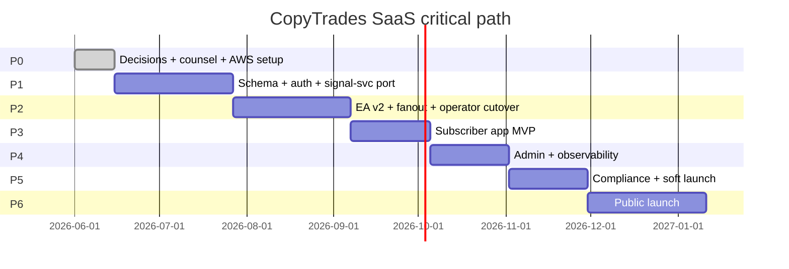

# 13 — Phasing and Milestones

Assumptions:
- Team: **2 engineers, full-time**, full-stack (one TS-strong, one Python-strong). Plus the owner part-time on product/legal/ops.
- Sprints: **2 weeks**, Monday–Friday week 1, M–Th week 2, demo+retro Friday week 2.
- Week numbering: Phase 0 starts week 0.

**Total**: 26 weeks (~6 months) to soft launch, ~32 weeks to public launch, ~8 months total. Aggressive but achievable for a 2-engineer team given the existing IP.

---

## Phase 0 — Decisions + Design Finalized (weeks 0–2)

**Scope**:
- Owner reviews + approves all 10 pre-decisions in §1 of 01.
- Counsel engaged (ADGM specialist + AML reviewer) — fee retainer in place.
- Domains registered (`copytrades.example.com` placeholder).
- AWS account opened, billing alerts at $100/$500/$1000.
- Stripe + Paddle test accounts open (for choice validation; commit to Paddle).
- Clerk + Resend + Persona + Datadog + Sentry test accounts.
- ADGM application started.
- The 17 plan documents reviewed; this phase's exit gate is **the owner signs off on every reversibility-cost-locked decision**.

**Tickets**:
1. P0-1: Owner sign-off on the 10 pre-decisions.
2. P0-2: ADGM application submitted (waiting for regulator timeline — non-blocking after submission).
3. P0-3: AWS org structure + IAM baseline + KMS CMKs created.
4. P0-4: GitHub repo `copytrades-saas/` created; monorepo skeleton (Turborepo + pnpm) committed.
5. P0-5: Branch protection, OIDC for AWS deploys.
6. P0-6: Counsel kickoff: draft ToS, Privacy, Risk Disclosure, Refund, AML, Cookies.
7. P0-7: Test accounts at Clerk/Resend/Paddle/Persona/Datadog/Sentry/Cloudflare; estimated bills documented.

**Exit criteria**:
- All sign-offs done.
- Monorepo builds an empty Next.js + an empty FastAPI image.
- CI/CD pipeline can deploy a "hello world" to staging ECS.

**Risks**: counsel takes longer than 2 weeks; non-blocking — design proceeds, but commit to ADGM only after counsel review.

---

## Phase 1 — Foundation (weeks 2–8)

**Scope**: multi-tenant Postgres schema; auth; signal-svc containerized + listener moved to cloud against a test Telegram chat; Python↔Node API contract working; subscriber app shell with onboarding skeleton.

**Tickets** (rough order):

| # | Owner | Ticket | Done = |
|---|---|---|---|
| P1-1 | TS | `packages/db/` Drizzle schema for §3 tables (identity + billing + product) | `pnpm db:push` to a fresh Postgres creates all tables; RLS policies applied; smoke test inserts an operator/subscriber row |
| P1-2 | TS | `packages/db/` schema for operational tables (messages, signal_actions, subscriber_actions, positions, …) | Same gate |
| P1-3 | TS | `packages/db/` schema for audit + retention | Same gate |
| P1-4 | TS | `apps/web/` Next.js skeleton + Clerk integration | Login works; `users` row written on first sign-in |
| P1-5 | TS | `apps/web/` onboarding wizard (4 steps) end-to-end without payment | A test user completes signup and arrives at `/dashboard` |
| P1-6 | PY | `apps/signal-svc/` Dockerfile + FastAPI entry; ports `orchestrator.py`, `ai.py`, `validators.py`, `state_summary.py`, `signal_memory.py`, `fingerprint.py`, `prefilter.py`, `trigger_matcher.py`, `profile_context.py`, `llm_provider.py` (Postgres-backed instead of SQLite) | Existing 166 hermetic tests pass against Postgres; the channel profile JSON loads; a fixture message → emits the expected validators-shaped actions |
| P1-7 | PY | `apps/signal-svc/` listener (Telethon) containerized; reads tg_session_blob from Postgres (envelope decrypted); writes to messages table | Connect to a test Telegram chat; receive a message; row appears in `messages` |
| P1-8 | TS | `apps/web/api/internal/` Hono routes for Python↔Node REST contract | `signal-svc` calls `/internal/v1/notify` and `web` receives |
| P1-9 | PY+TS | KMS envelope encryption helpers in both Python and TS | Same plaintext encrypts → decrypts both ways via a small CLI tool |
| P1-10 | TS | Drizzle migrations gate in CI | A PR that drops a column blocks merge if there's data dependency |
| P1-11 | TS | Local dev: docker-compose with Postgres + Redis; seed data | `pnpm dev` works on both engineers' machines |
| P1-12 | PY | Cost guard ported to per-provider scope; writes `audit.ai_calls` | Mock LLM call accumulates cost; budget trip flips provider.halted |

**Exit criteria**:
- A Telegram test channel can publish messages, the listener captures them, the orchestrator emits `signal_actions`, the operator sees them in `/admin/providers/1/journal`.
- A new user can sign up via Clerk and land at `/dashboard` (showing "no broker connection yet").
- Postgres migrations apply cleanly to a fresh database.

**Critical-path items**: Drizzle schema (P1-1/2/3), listener cloud-port (P1-7), KMS helpers (P1-9). Slip-risk: P1-6 (porting the orchestrator) and P1-7 (Telethon in a container often surfaces auth edge cases).

**Effort**: ~12 engineer-weeks (2 engineers × 6 weeks).

---

## Phase 2 — Execution Bridge (weeks 8–14)

**Scope**: EA v2 talks to cloud; operator's broker plays subscriber-#1 end-to-end; fan-out worker; staged-management surviving the cutover.

**Tickets**:

| # | Owner | Ticket | Done = |
|---|---|---|---|
| P2-1 | TS | `apps/ea-api/` FastAPI service; bearer auth → broker_connection resolution | `/v1/ea/connection/me` returns the right config given a token |
| P2-2 | TS | All EA endpoints from §4 list; per-route idempotency | Postman collection passes |
| P2-3 | TS | Status-guarded `post_result` + the §5 unique constraints | Race-condition test (two simulated EAs claim same action) yields exactly one win |
| P2-4 | PY | `apps/worker/` fan-out worker (TS) — risk gates, lot sizing, skipped reasons | Replay a recorded `signal_action` produces N `subscriber_actions` with correct payloads |
| P2-5 | PY | Three sweepers: promote_due, release_stale_claims, expire_stale_actions | Tests with `freezegun`-equivalent (TS: vitest fake timers) |
| P2-6 | EA | `ea-v2/CopyTrades.mq5` transport rewrite: WebRequest → cloud URL + bearer + cert pin | Demo broker; one signal end-to-end |
| P2-7 | EA | EA v2 dedup tests: pending action dedup (the 2026-05-27 fix), RegisterPlan dedup-by-ticket, ManagePlans staged-close ladder unchanged | Each fired against the demo broker |
| P2-8 | EA | `connection_config_version` push of risk-profile changes without re-attach | Subscriber edits `chase_price_enabled` in UI; EA picks up on next poll |
| P2-9 | TS | Subscriber risk-profile UI (broker connection page) | Edit + persist + observable in EA |
| P2-10 | TS | Subscriber broker-creation flow (token shown once; download EA bundle) | Subscriber adds a connection and the EA can authenticate |
| P2-11 | TS | Admin "Replay" page to re-emit a historical message through orchestrator | A message that originally was triaged ignored can be force-re-emitted |
| P2-12 | PY | Migration script `migrate_sqlite_to_pg.py` skeleton | A dummy SQLite imports into Postgres staging |
| P2-13 | EA | EA v2 retry queue + GlobalVariables persistence preserved | Demo: drop network, restart MT5, in-flight plans recover |

**Exit criteria**:
- **The operator's own MT5 + the operator's own broker account, on demo first then on live, executes a trade triggered by a real Telegram signal in the cloud platform.** This is the moment we know we have a product.
- All EA v2 regression tests pass against the staged-management policy (1-TP/2-TP/3-TP ladders, BE moves, trail).
- Migration script runs against a copy of the operator's SQLite.

**Critical-path items**: P2-6 (EA v2 transport), P2-3 (status guards), P2-12 (migration script).

**Effort**: ~12 engineer-weeks.

---

## Phase 3 — Subscriber App MVP (weeks 14–18)

**Scope**: full subscriber surface (dashboard, trades, billing, broker linking, risk controls, notifications, settings).

**Tickets**:

| # | Owner | Ticket | Done = |
|---|---|---|---|
| P3-1 | TS | `/dashboard` with SSE — open positions + recent actions | Real-time updates from server |
| P3-2 | TS | `/trades` table + `/trades/[id]` detail | Subscriber sees skip reasons, raw signal text, lifecycle timeline |
| P3-3 | TS | `/billing` + Paddle checkout integration | Subscriber can change plan; webhooks land |
| P3-4 | TS | `/brokers` CRUD + token rotate + EA download bundle | Real subscriber can onboard a fresh broker connection without help |
| P3-5 | TS | `/notifications` preferences + Telegram opt-in deep-link | Telegram DM works |
| P3-6 | TS | `/settings` (profile, MFA via Clerk, sessions, GDPR export, delete) | All flows work; deletion job runs |
| P3-7 | PY/TS | Notifications worker: email + Telegram + webhook + in-app | Hot signal blasts all 4 channels |
| P3-8 | TS | Email templates (React Email): all 25 from §8 | Visual regression snapshots committed |
| P3-9 | TS | Trial enforcement + plan feature gating | Starter can't create 4th broker connection |
| P3-10 | TS | `marketing` site (landing + pricing + policies) | Static, performant, SEO basics |
| P3-11 | TS | Onboarding analytics events (PostHog) | Drop-off step measurable |
| P3-12 | PY | Provider profile editor (admin-only but Phase 3 because subscribers depend on it) | Admin edits triggers/profile; new version applied without restart |

**Exit criteria**:
- A non-engineer can sign up, pay, install the EA on their own MT5, and execute a signal end-to-end.
- Email + Telegram + in-app notifications all fire.
- Subscriber can cancel and re-subscribe.

**Effort**: ~10 engineer-weeks.

---

## Phase 4 — Admin + Ops Tooling + Observability (weeks 18–22)

**Scope**: admin surface, runbooks, alerts, status page, audit.

**Tickets**:

| # | Owner | Ticket | Done = |
|---|---|---|---|
| P4-1 | TS | `/admin/subscribers` list + detail + timeline | Operator can find any subscriber |
| P4-2 | TS | Impersonation flow (read-only default, MFA-gated write) | Audit row written; banner visible |
| P4-3 | TS | `/admin/providers` triggers + unmatched curation | Port of GUI Triggers tab works |
| P4-4 | TS | `/admin/providers/[id]/pipeline` live stream (WebSocket) | Each message advances through stages visibly |
| P4-5 | TS | `/admin/system/health` + EA fleet status | Stale connections visible, drillable |
| P4-6 | TS | `/admin/billing` revenue + refund flow | Refund issued via Paddle API; audit row |
| P4-7 | TS | `/admin/audit` search across the audit.* tables | Slow query OK; we paginate |
| P4-8 | PY | All 10 runbooks (§11) documented and rehearsed | Tabletop exercise per runbook |
| P4-9 | TS | Datadog dashboards (1 per service) + alerts wired to PagerDuty | P1/P2/P3 alerts fire and route correctly |
| P4-10 | TS | Sentry source-map upload on every deploy + PII scrubbing | Real errors visible with subscriber context redacted |
| P4-11 | TS | Status page hooked to synthetics | Public-facing; updates auto |
| P4-12 | PY | Restore drill: nightly snapshot restored to staging | Automated as monthly job |

**Exit criteria**:
- Ops can resolve any of the top 10 incidents using runbooks.
- Alerts page correctly; nothing critical lives only in CloudWatch.
- Status page accurately reflects the system.

**Effort**: ~8 engineer-weeks.

---

## Phase 5 — Compliance + Soft Launch (weeks 22–26)

**Scope**: legal sign-off; KYC integration; geo-blocking live; up to 10 friends-and-family subscribers.

**Tickets**:

| # | Owner | Ticket | Done = |
|---|---|---|---|
| P5-1 | TS+legal | All policy docs published + versioned in `system_config.policy_versions` | Subscriber acceptance tracked in `subscribers.tos_version_accepted` |
| P5-2 | TS | Geo-block at Cloudflare WAF + app-layer double-check | Red list IPs hit a "Not available" page; amber routed to KYC |
| P5-3 | TS | Persona KYC integration: trigger conditions + flow + webhook | Test KYC inquiry creates inquiry, approves, sets subscriber state |
| P5-4 | TS | Risk disclosure acceptance gate at signup | Subscriber cannot start trial without explicit acceptance |
| P5-5 | TS | Required disclaimers in every trade notification template | Verified in template snapshots |
| P5-6 | Legal | DPAs signed with all 12 vendors per §9 | Files in legal vault |
| P5-7 | Legal | ADGM license issued OR amended timeline (if regulator slower than us, launch via BVI as Plan B) | Decision documented |
| P5-8 | Owner | Marketing site final copy + brand | Live |
| P5-9 | TS | Cookie consent banner + analytics opt-out | Per GDPR / ePrivacy |
| P5-10 | All | Soft launch: invite 10 friends-and-family | 10 subscribers onboarded; first real chargeable invoices |
| P5-11 | All | First 30-day support cycle | Iterate on rough edges; close top-10 support tickets |

**Exit criteria**:
- Legal sign-off (or documented exception with risk-register entry).
- 10 active paying subscribers.
- No P1 incidents in the launch week.
- Top subscriber-reported issues triaged.

**Effort**: ~8 engineer-weeks.

---

## Phase 6 — Public Launch (weeks 26–32)

**Scope**: marketing-driven acquisition; scale to 50.

**Tickets**:

| # | Owner | Ticket | Done = |
|---|---|---|---|
| P6-1 | Owner | Paid acquisition (Telegram ads, Google, Twitter) cohort tests | First 25 paid subscribers |
| P6-2 | Owner | Content marketing in Arabic | 5 blog posts; one webinar |
| P6-3 | TS | Acquisition analytics dashboard | Channel-attributed cohorts visible |
| P6-4 | TS | Performance tuning at 50-sub load (LLM cost, queue lag, Telegram drain) | All SLOs met under load |
| P6-5 | All | First post-mortem culture: every P1 gets a post-mortem in 48h | 100% post-mortem rate |
| P6-6 | TS | Self-serve refund (per Refund Policy) | Subscriber clicks "Refund" inside trial window |
| P6-7 | TS | Knowledge base — top 20 articles | Public, indexable |

**Exit criteria**: 50 paying subscribers; churn <10%/month; NPS measured.

**Effort**: ~12 engineer-weeks (parallel marketing & polish).

---

## Critical path summary

---

## Deferred (post-launch)

- Mobile native apps (iOS/Android)
- Marketplace of signal providers (2nd, 3rd channel onboarding) — single-channel sufficient for v1
- Second asset class (FX majors, crypto)
- Centralized broker integration (MetaApi/cTrader — Path C addition)
- Advanced backtester / simulator
- Light theme
- Social features (leaderboards, follower counts)
- Investor reporting / institutional onboarding
- B2B (white-label, organization model — Clerk orgs already in schema)
- Self-serve KYC for amber-list at higher tiers
- Automatic broker discovery / MetaApi onboarding flow
- AI-personalized risk-profile suggestions
- Per-subscriber LLM keys (BYO)
